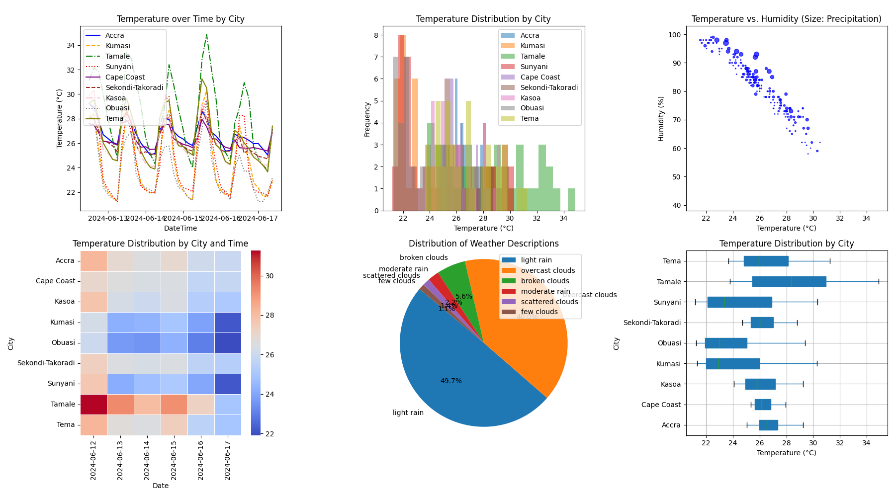

# WEATHER ETL PIPELINE
This is 

## Project Overview
Event planning organizations face challenges when planning outdoor events due to unpredictable weather conditions. By leveraging weather data, these organizations can make informed decisions, optimize event schedules, and ensure better customer experiences. This project aims to create an ETL (Extract, Transform, Load) pipeline to collect, process, and visualize weather data to assist event planners in making data-driven decisions

## Systems Architecture


## Objectives
1. Collect weather data from an external API.
2. Transform and clean the data for analysis.
3. Load the processed data into a PostgreSQL database.
4. Create visualizations to provide insights into weather patterns.
5. Schedule and automate the entire ETL process using Apache Airflow.

## Scope
This project focuses on building a robust and automated ETL pipeline using Python, Docker, PostgreSQL, and Apache Airflow, and visualizing the processed data using Matplotlib.

## Prerequisites
Ensure you have the following installed:
* Docker (including Docker Compose)
* Python 3.7+
* Airflow (included [Here](requirements.txt))

## Setup Instructions

### Clone The Repository
```shell
git clone https://github.com/yourusername/weather-etl-pipeline.git
cd weather-etl-pipeline
```

### Install Dependencies
```shell
pip install -r requirements.txt
```

### Set Up Environment Variables
Create a .env file in the root directory and add the necessary environment variables:

```shell
API_KEY=your_api_key
SMS_API_KEY=your_sms_api_key
SMS_RECIPIENT=recipient_number
POSTGRES_USER=your_postgres_user
POSTGRES_PASSWORD=your_postgres_password
POSTGRES_DB=your_database_name
```

### Start the Docker Container
```shell
docker-compose up -d
```

### Initialize the airflow
```shell
airflow db init
```

### Add Airflow User
```shell
airflow users create \
    --username admin \
    --firstname FIRST_NAME \
    --lastname LAST_NAME \
    --role Admin \
    --email admin@example.com
```

### Start Airflow Scheduler and Webserver
In separate terminals, run the following commands:

```shell
airflow scheduler
```

```shell
airflow webserver -p 8080
```

### Load and Trigger the DAG
1. Copy your DAG script (weather_data_pipeline_dag.py) to the Airflow DAGs folder (~/airflow/dags).
2. Access the Airflow web interface at http://localhost:8080.
3. Toggle the switch to activate your DAG.
4. Trigger the DAG manually or wait for the scheduled run.

## Procedure
1. **Data Ingestion** : Collects weather data from an external API and stores it temporarily
2. **Data Transformation** : Cleans and processes the raw data for analysis.
3. **Data Loading** : Loads the transformed data into a PostgreSQL database.
4. **Visualization** : Uses Matplotlib to create visualizations of weather patterns.

## Example Directory Structure

## Weather Data Visualization
This visualization shows the processed weather data, providing insights into weather patterns that can help event planners make informed decisions.



## Future Work
* Deploy the pipeline on a cloud platform for better scalability and availability.
* Integrate real-time data processing capabilities.
* Enhance visualizations using advanced BI tools like Power BI or Tableau.

## Conclusion
This project demonstrates how to build an automated ETL pipeline using modern data engineering tools and technologies. The pipeline efficiently collects, processes, and visualizes weather data to aid event planning organizations in making informed decisions.
